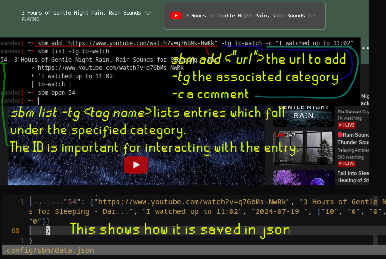

sbm
---
sbm is the Simple Bookmark Manager, a simple CLI tool. The aim of the project is to create a bookmark manager, which also acts as an extendable base to add features to.

This project is solely targetted towards GNU/Linux.

Features:
- Bookmarks and tags
- Simple commands
- [Suckless](https://suckless.org/philosophy/)-styled
- Small codebase (~1.2K SLOC), written in C99

Building
--------
Dependencies: libcurl4, [json.h](https://github.com/sheredom/json.h).

`make`, followed by `make install` to install.

Portfolio and Demo
------------------
This was made as part of my code portfolio. I used it for a few weeks while I used a bookmark-less browser called Surf.

The goal of the project was to show input parsing, doing *something* with the data, then storing it.

Problems
--------
It will usually stall and fail to read webpage titles (so set them manually with -t "<title>").

URLs usually have to be entered in quotation marks (like "<link>"). I vaguely recall that whenever this is an issue, it will incorrectly print that it is an issue with tag parsing.

As I rushed the project, the code is a lot larger than it should be, and could easily be refactored down by half.
